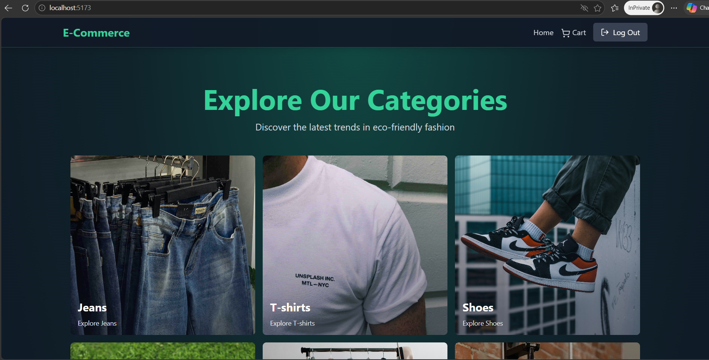
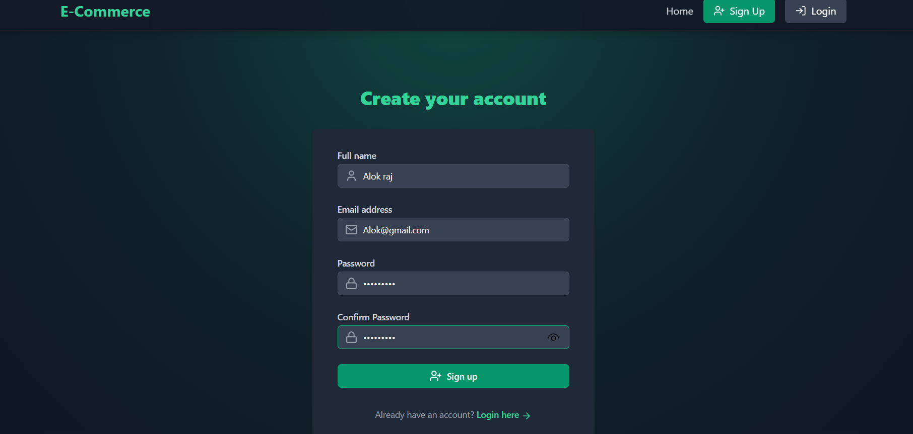
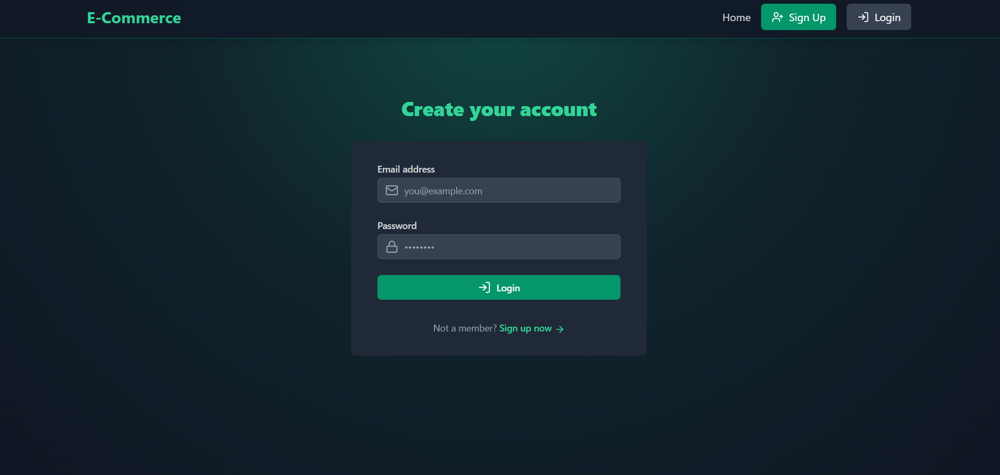

<h1 align="center">🛒 CartNova</h1>

<p align="center">
Modern Full Stack MERN eCommerce Web Application
</p>

<p align="center">
Responsive • Secure • Fast • Modern UI
</p>

---

# 🚀 About The Project

CartNova is a modern and responsive full stack eCommerce web application built using the MERN Stack.

The application provides users with a smooth online shopping experience including product browsing, authentication, cart management, and admin controls.

This project is built for learning full stack development and can also be used as a strong resume project.

---

# ✨ Features

## 👤 User Features

- User Authentication (Login & Signup)
- Browse Products
- Product Details Page
- Add to Cart
- Remove From Cart
- Protected Routes
- Responsive Design
- Modern UI

---

## 🛠️ Admin Features

- Manage Products
- Manage Orders
- Manage Users
- Dashboard Access

---

# 🧰 Tech Stack

## 🎨 Frontend

- React.js
- Axios
- Tailwind CSS
- React Router DOM

---

## ⚙️ Backend

- Node.js
- Express.js
- JWT Authentication

---

## 🗄️ Database

- MongoDB

---

# 📂 Folder Structure

```bash
CartNova/
│
├── frontend/
├── backend/
├── screenshots/
└── README.md
```

---

# ⚙️ Installation

## 1️⃣ Clone Repository

```bash
git clone https://github.com/imapurvsatyam/CartNova.git
```

---

## 2️⃣ Install Dependencies

### Frontend

```bash
cd frontend
npm install
```

### Backend

```bash
cd backend
npm install
```

---

# ▶️ Run Project

## Start Frontend

```bash
cd frontend
npm run dev
```

---

## Start Backend

```bash
cd backend
npm run server
```

---

# 🌟 Future Improvements

- Online Payment Integration
- Wishlist Functionality
- Product Reviews & Ratings
- Dark/Light Theme
- Order Tracking
- Email Notifications
- Search & Filter Products

---

# 📸 Screenshots

## 🏠 Home Page



---

## 🔐 Signup Page



---

## 🔑 Login Page



---

# 👨‍💻 Developer

## Apurv Satyam

### 🔗 GitHub
https://github.com/imapurvsatyam

### 💼 LinkedIn
https://www.linkedin.com/in/apurv-satyam-5a72662b8

---
